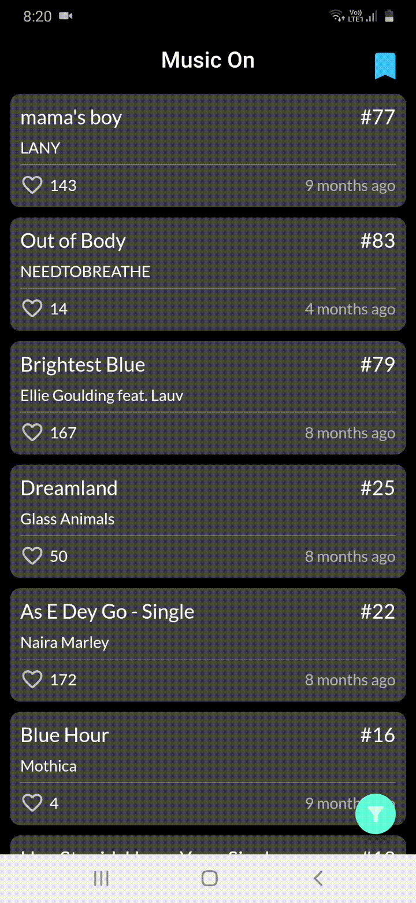
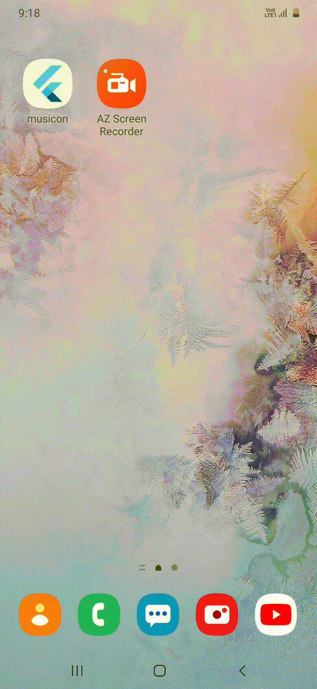

# musicon
App to have millions of song albums with their lyrics and the one you love bookmark those.

# Features

1. Uses Rest Api from https://www.musixmatch.com/.
2. Infinite Pagination for your Tracks list.

3. Filter Tracks according to your choice.

4. Have the lyrics of tracks which you want.

5. Hive a noSQL database to store your bookmarks tracks locally on your phone.

6. Sense your network connection to get you notified , when theirs no network connection.

